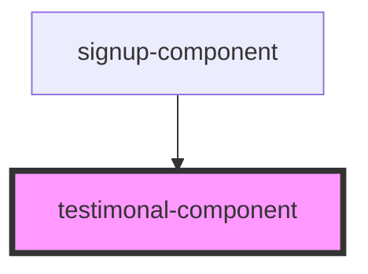

# signup-component

<!-- Auto Generated Below -->

## Properties

| Property     | Attribute    | Description | Type  | Default     |
| ------------ | ------------ | ----------- | ----- | ----------- |
| `data`       | `data`       |             | `any` | `undefined` |
| `typography` | `typography` |             | `any` | `undefined` |

## Dependencies

### Used by

 - [signup-component](.)

### Graph

----------------------------------------------

*Built with [StencilJS](https://stenciljs.com/)*
